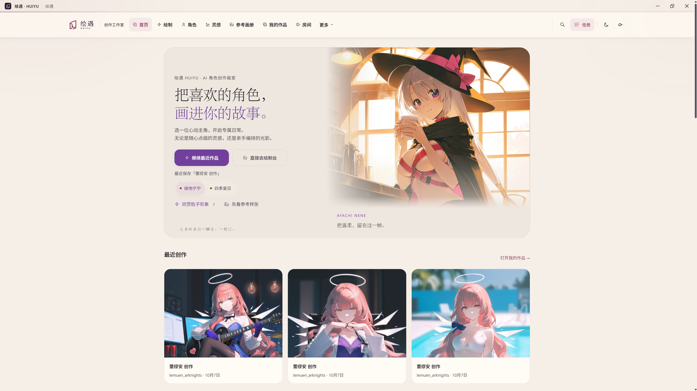
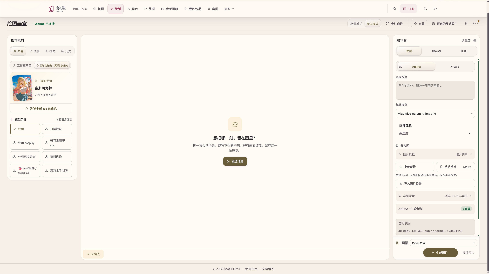
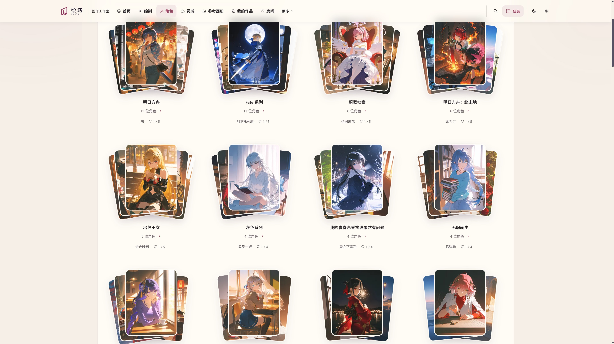
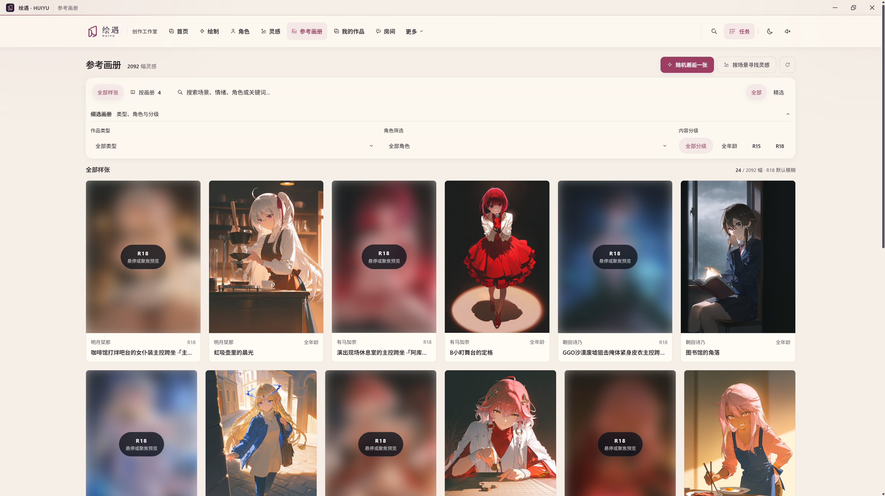
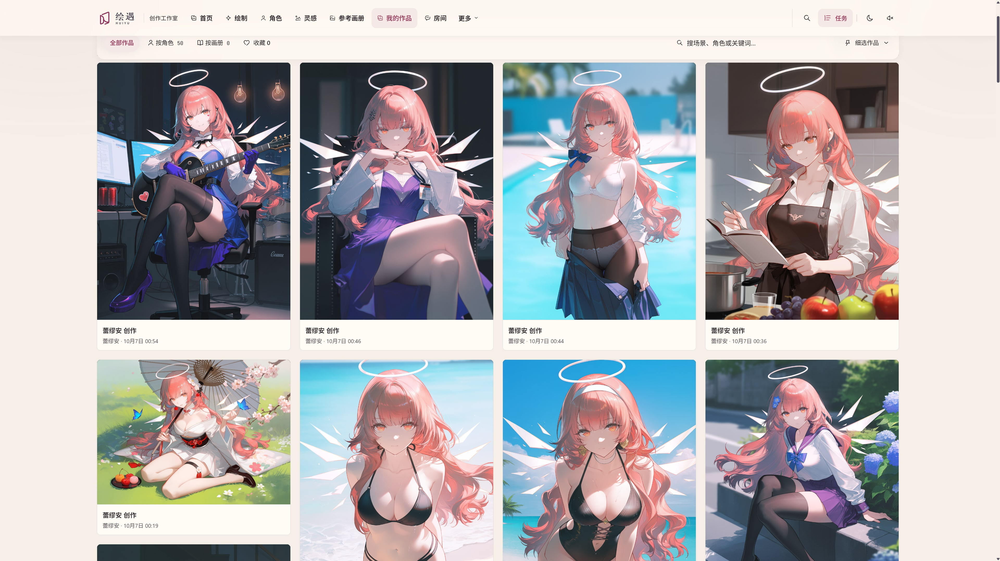
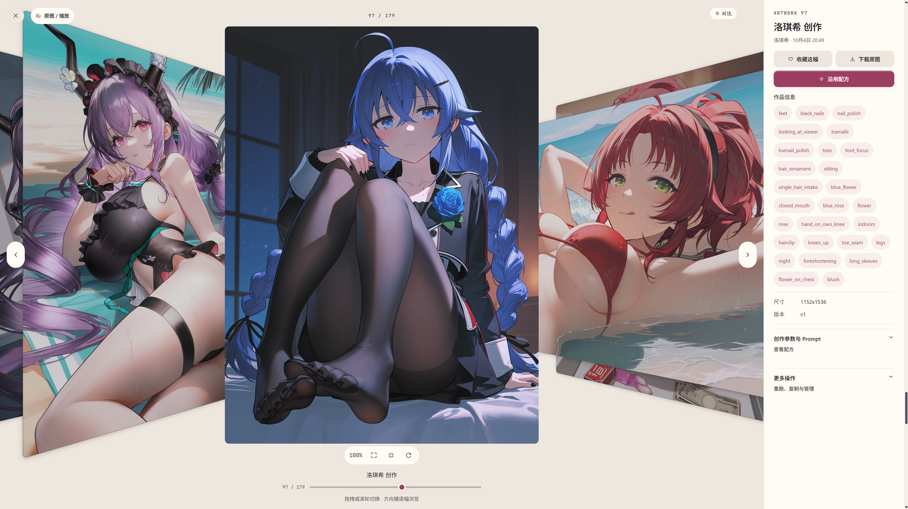

<p align="center"><picture><source media="(prefers-color-scheme: dark)" srcset="assets/logo.svg"></picture></p>

<h1 align="center">把喜欢的角色，画进你的故事。</h1>

<p align="center">本地运行的 AI 角色创作工作室 · 绘图、灵感画册、作品收藏与桌面陪伴</p>

<p align="center"><a href="https://github.com/starplatium1129-stack/huiyu/releases/tag/v1.9.2">下载 Windows 桌面版 1.9.2</a> · <a href="docs/releases/v1.9.2.md">更新说明</a> · <a href="README.md">English</a></p>

绘遇从角色和场景出发：选一位主角，挑选衣装、镜头与光线，把想象整理成一张 CG，再把成片和生成配方一起留在自己的作品册里。可以直接创作，也可以先翻翻参考画册，寻找下一幕的灵感。

[](docs/images/software-preview/home.jpg)

##  一张画，从这一幕开始

左侧挑选角色和创作素材，中间看画面，右侧调整生成设置。场景模式帮助整理想法，专家模式提供模型、画师风格、提示词与采样参数；需要时可以导入参考图、反推描述或局部换装。

[](docs/images/software-preview/drawing-studio.jpg)

##  角色、灵感与自己的作品册

<table>
  <tr>
    <td width="50%"><strong>角色书架</strong><br>按作品浏览角色，挑选造型与场景。<a href="docs/images/software-preview/character-library.jpg"></a></td>
    <td width="50%"><strong>参考画册</strong><br>按角色、场景与分级寻找灵感；受保护图片保持模糊预览。<a href="docs/images/software-preview/reference-album.jpg"></a></td>
  </tr>
  <tr>
    <td width="50%"><strong>我的作品</strong><br>按角色和画册整理成片，收藏喜欢的一张。<a href="docs/images/software-preview/my-works.jpg"></a></td>
    <td width="50%"><strong>立体观画</strong><br>翻阅大图、查看生成信息，沿用配方继续创作。<a href="docs/images/software-preview/artwork-viewer.jpg"></a></td>
  </tr>
</table>

以上六张截图由作者提供，保留 3840×2158 原始尺寸，点击查看大图。

##  创作工具

| 功能 | 当前支持 |
| --- | --- |
| 本地绘图 | Anima 与 Krea 2；提示词按所选引擎编译 |
| Anima 底模 | 默认 MiaoMiao Harem 1.6，另有 Base、Aesthetic、Yume、MiaoMiao 1.2 与新接入的 MiaoMiao 2.9B Beta 1.1 |
| 角色 LoRA | 宁宁、夏目 Anima v21 由绘遇作者亲自训练；另接入终末地角色合集，按底模与角色匹配 |
| 短片工作台 | 分镜、参考图与本地 Wan 2.2 TI2V 5B／MiniMax H3 路径 |
| 模型准备 | 在控制室选择 AI 工作目录、模型与运行环境，显式准备后下载并核对文件 |
| 作品与配方 | 成片入册、搜索收藏、历史配方沿用、场景与蓝图编辑 |

MiaoMiao 2.9B Beta 1.1 已完成一张本机全年龄样图和 TeaCache 0.08 的实际工作流验证，暂按无角色 LoRA 路径使用。SD／WAI 新生成已退役，旧作品、任务查询和原配方事实保留。完整的权重、硬件与能力边界见[模型与环境指南](docs/guides/setup-and-models.md)。

##  角色房间与桌面陪伴

独立角色房间支持文字聊天、Live2D 展示与语音播放；桌面陪伴窗可以留在手边。聊天可连接兼容 API、已有 Ollama，或准备本地 llama.cpp 与 GGUF。语音、翻译和口型需要相应服务与角色资源；控制室管理连接和模型资源释放。

##  安装与开始创作

1. 在 [1.9.2 发布页](https://github.com/starplatium1129-stack/huiyu/releases/tag/v1.9.2)下载安装包。新用户或资源修复选 **full 完整包**；已有完整安装选 **upgrade 升级包**。
2. 按[离线素材指南](docs/guides/offline-resources.md)导入需要的素材。完整资源包与程序分开发行，已有素材不必因程序升级重复下载。
3. 打开控制室，选择数据目录和 AI 工作目录，准备所需模型，或连接已有服务。
4. 进入绘制工作台，选角色与场景，生成后保存到“我的作品”。

**安装成品无需 Node.js 或 Rust。** 浏览素材和作品可离线使用；AI 生成需要对应模型与运行环境，在线下载和远程 API 需要联网。模型权重不捆绑在程序安装包中。

##  从源码运行

Windows 为主要开发与桌面运行环境。源码构建需要 Node.js ≥22.18、npm 与 Rust MSVC 工具链；本地绘图另需 ComfyUI。

```powershell
git clone https://github.com/starplatium1129-stack/huiyu.git
cd huiyu
npm ci
npm run build
npm run start:run
```

运行细节见 [STARTUP](STARTUP.md)，桌面构建与安装见[部署指南](docs/desktop-deployment.md)，维护入口见[工作流](docs/workflow.md)。

## 技术架构

绘遇由三个主要部分组成：**Vue 工作台、Tauri 桌面壳和 Rust 本地网关**。前端通过统一 API 使用工作区、内容与生成任务；网关负责持久化、任务生命周期和外部 AI 服务连接。

| 层 | 技术与职责 |
| --- | --- |
| 工作台 | Vue 3、TypeScript、Vite、Pinia；组件展示、创作状态、提示词编译与界面交互 |
| 桌面壳 | Tauri 2、Rust；窗口与托盘、桌面陪伴、原生 Live2D 与自有网关管理 |
| 本地网关 | Rust、Axum、Tokio；HTTP／流式接口、任务准入、查询取消、媒体与资源管理 |
| 数据与内容 | 桌面 SQLite 管理工作区元数据与内容目录，Web 使用 IndexedDB；图片等媒体单独存放 |
| AI 服务 | ComfyUI 绘图与视频；llama.cpp／Ollama／兼容 API 聊天；独立反推、翻译和语音服务 |
| 构建与维护 | Node.js、npm 与项目脚本；前端构建、资源准备、发行封装与隔离测试 |

角色、服装、场景和蓝图以运行目录的 `content/catalog.sqlite` 为工作权威，`data/catalog/` 是显式导出的项目快照。模型与用户作品保存在本机选择的目录。工程边界见[工程契约](docs/engineering-contracts.md)，工作区与内容设计见[文档索引](docs/INDEX.md)。

## 项目目录

```text
AI-CG-Studio/
├── src/                    Vue 工作台
│   ├── views/              页面与路由视图
│   ├── components/         界面组件、手绘图标与绘制面板
│   ├── composables/        创作、生成与交互状态编排
│   ├── stores/             Pinia 状态
│   ├── application/        用例与端口
│   ├── platform/           Web／desktop 适配
│   ├── api/                API 客户端与响应边界
│   └── utils/              提示词、配方与其他共享逻辑
├── runtime-rs/             Rust 网关、任务、存储与服务适配
├── desktop-tauri/          Tauri 桌面宿主与原生 Live2D
├── types/                  跨端契约类型
├── data/                   内容快照、模型配方与资源索引
├── assets/                 品牌、人物与界面静态资源
├── scripts/                构建、维护、发行与定向检查入口
├── tests/                  浏览器与端到端用例
├── tools/                  独立模型服务与安装助手
├── docs/                   指南、架构、版本说明与证据
└── plans/                  统一规划入口
```

本机 `runtime/` 保存构建缓存和原始验收材料，不作为产品源码提交。常用开发维护命令统一从 `npm run workflow -- --help` 查找。

## 项目与许可

绘遇是个人使用、偶尔与朋友分享的非商业爱好项目。代码采用 [MIT 许可](LICENSE)；模型、人物、Live2D、图片与其他资源遵循各自许可。项目与动漫、游戏原作及其权利方没有隶属关系。

[项目状态](docs/project-status.md) · [未来规划](docs/roadmap.md) · [文档索引](docs/INDEX.md) · [问题反馈](https://github.com/starplatium1129-stack/huiyu/issues)
